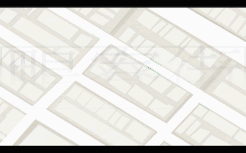

# ComeHere

ComeHere, an integrated android application to help spotter and seeker to search something specific in Apliu Street. Also, helping vendor to create their own inventory database as to build a flea market platform.

---

## Conception

#### All in One Platform. A New Ecosystem by Community

A simple platform for seeker to make a request, vendor to manage request
to let seeker to know where the product is. Application will direct seeker to the
corresponding place have his target goods. For seeker, even there is no response
at the moment, seeker do not need to keep track as vendor will push the
notification to seeker. It will be easier to spot product in chaos. More than that,
inventory database will be generated effortless for vendor that it is mutually
beneficial for seeker and vendor for future product searching. Only a tidier system
will be stored on the street.

ComeHere, is going to open the door to breakthroughs in
retailing and become smarter.

---

## Features

- Intuitive navigation to corresponding product or shop
- Inventory Management System

### Technology:

- short distance wireless sensors (Estimote Beacons)

---

## Developing

- Demand Forecasting
